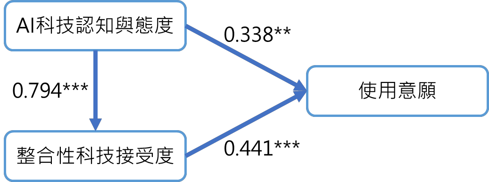

# 2023bemst全文

作者：施育廷

## 文章簡述

人工智慧 (AI) 相關應用的使用率正在各個領域迅速增加 , 如藝術創作 、 醫療保健、 金融管理、教育應用等範疇。AI 的相關應用對於改變學習者學習和教師教學的方式具 有潛力影響。了解學習者使用人工智慧相關應用程式的行為意圖因素,對於教師教學策 略的應用至關重要。本研究旨在探…

## 研究重點

- 研究背景：人工智慧 (AI) 相關應用的使用率正在各個領域迅速增加 , 如藝術創作 、 醫療保健、 金融管理、教育應用等範疇。AI 的相關應用對於改變學習者學習和教師教學的方式具 有潛力影響。了解學習者使用人工智慧相關應用程式的行為意圖因素,對於教師教學策 略的應用至關重要。本研究旨在探…
- 研究方法：人工智慧 (AI) 相關應用的使用率正在各個領域迅速增加 , 如藝術創作 、 醫療保健、 金融管理、教育應用等範疇。AI 的相關應用對於改變學習者學習和教師教學的方式具 有潛力影響。了解學習者使用人工智慧相關應用程式的行為意圖因素,對於教師教學策 略的應用至關重要。本研究旨在探討學習者對於人工智慧(AI)技術的認知和…
- 主要發現：研究數據使用結構方程模型(SEM)進行了分析。結果顯示,學習者對 AI 科技的 認知與態度對整合性科技接受度和 AI 科技使用意願具有正向影響,而整合性科技接受 度對 AI 科技使用意願也具有正向影響 。
- 延伸意義：可延伸關注的主題包括：AI 科技認知與態度、整合性科技接受度、使用意願。

## 關鍵主題

AI 科技認知與態度、整合性科技接受度、使用意願

## 內容摘述

人工智慧 (AI) 相關應用的使用率正在各個領域迅速增加 , 如藝術創作 、 醫療保健、 金融管理、教育應用等範疇。AI 的相關應用對於改變學習者學習和教師教學的方式具 有潛力影響。了解學習者使用人工智慧相關應用程式的行為意圖因素,對於教師教學策 略的應用至關重要。本研究旨在探討學習者對於人工智慧(AI)技術的認知和態度對整 合性科技接受度和 AI 技術使用意願的影響。 研究使用了自An、Chai、Li、Zhou、Shen、 Zheng 和 Chen (2022)所發展的人工智慧科技整合性科技接受模型和 Liao 與 Lu (2008)的 學習使用意願量表。研究問題包括學習者 AI 科技認知與態度是否影響整合性科技接受 度,學習者 AI 科技認知與態度是否影響 AI 科技使用意願,以及整合性科技接受度是否 影響 AI 科技使用意願。 研究數據使用結構方程模型(SEM)進行了分析。結果顯示,學習者對 AI 科技的 認知與態度對整合性科技接受度和 AI 科技使用意願具有正向影響,而整合性科技接受 度對 AI 科技使用意願也具有正向影響 。 這些結果強調了學習者對 AI 技術的認知和態度 對於科技接受度和使用意願的重要性。

## 圖像摘錄

