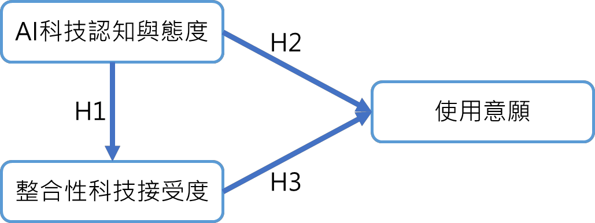

# Analysis of Learners' Technological Cognition and Attitudes Toward AI Educational Applications, Integrated Technology Acceptance, and Behavioral Intention

Author: Yu-Ting Shih

## Overview

This article centers on Analysis of Learners' Technological Cognition and Attitudes Toward AI Educational Applications, Integrated Technology Acceptance, and Behavioral Intention and highlights the study background, method, findings, and practical implications.

## Key Points

- Background: This article centers on Analysis of Learners' Technological Cognition and Attitudes Toward AI Educational Applications, Integrated Technology Acceptance, and Behavioral Intention and highlights the study background, method, findings, and practical implications.
- Method: The study presents a clear research design that can support further work in educational technology and AI-supported learning.
- Findings: The article highlights the value and applicability of AI-related approaches in educational and learning contexts.
- Significance: This article can serve as a reference point for future research design, instructional practice, or system development.

## Summary

This article centers on Analysis of Learners' Technological Cognition and Attitudes Toward AI Educational Applications, Integrated Technology Acceptance, and Behavioral Intention and highlights the study background, method, findings, and practical implications.

## Extracted Figures

