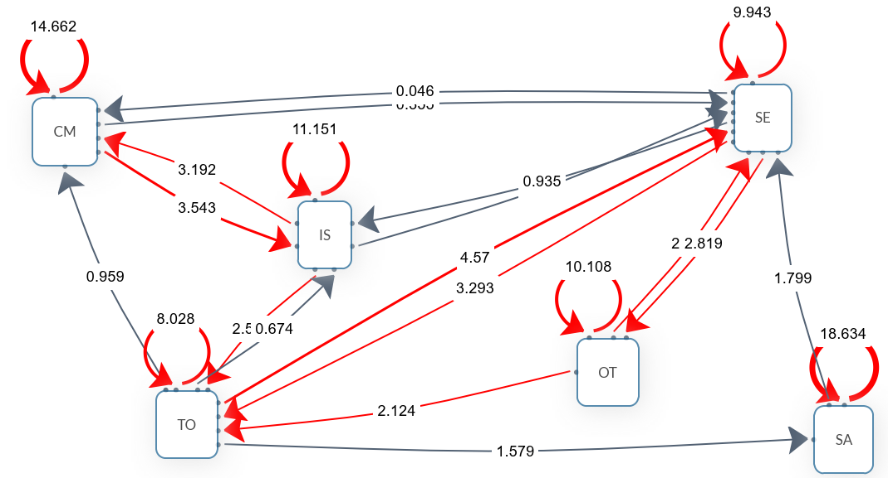

# Behavioral Analysis of Human-AI Interaction in AI-Assisted Programming and Data Science Learning

Author: Yu-Ting Shih

## Overview

The rapid advancement of artificial intelligence (AI) has positioned data science and programming as essential competencies in higher education.

## Key Points

- Background: The rapid advancement of artificial intelligence (AI) has positioned data science and programming as essential competencies in higher education.
- Method: The study presents a clear research design that can support further work in educational technology and AI-supported learning.
- Findings: The article highlights the value and applicability of AI-related approaches in educational and learning contexts.
- Significance: Relevant themes for follow-up discussion include: Lag Sequential Analysis, Generative AI, Programming Education.

## Keywords

Lag Sequential Analysis, Generative AI, Programming Education

## Summary

The rapid advancement of artificial intelligence (AI) has positioned data science and programming as essential competencies in higher education. However, students without a computer science background often struggle with the abstract reasoning required for programming. This study explores how 103 undergraduates interacted with an AI-based virtual learning partner during a general education course, analyzing 710 dialogue records through lag sequential analysis. Results identified seven behavior types and revealed that task submission (TS) was the most frequent, reflecting a highly task-oriented learning style. A key finding was the bidirectional transition between information seeking (IS) and cognitive/metacognitive interaction (CM), forming a "learning exploration loop" indicative of reflective and integrative learning strategies. Transitions from IS to task-oriented requests (TO) further showed students applying knowledge to concrete tasks. Social engagement (SE) patterns, including…

## Extracted Figures

