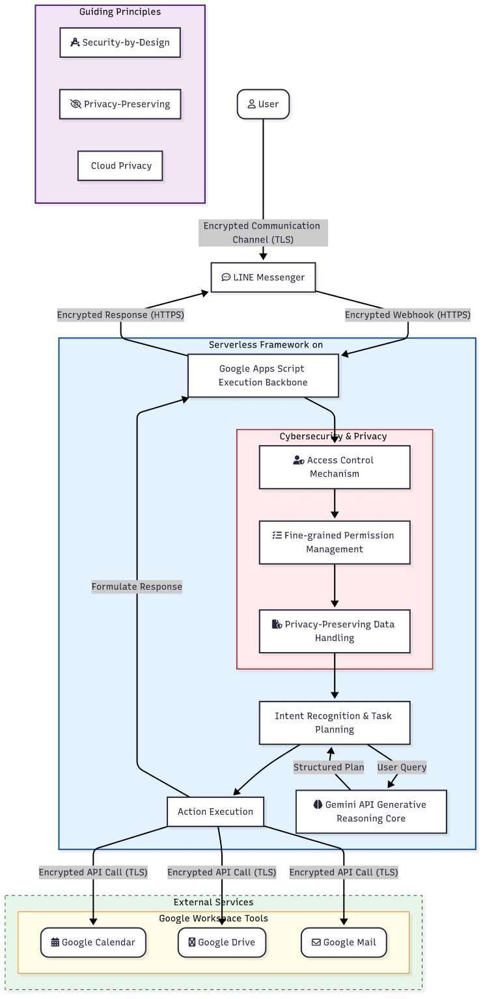
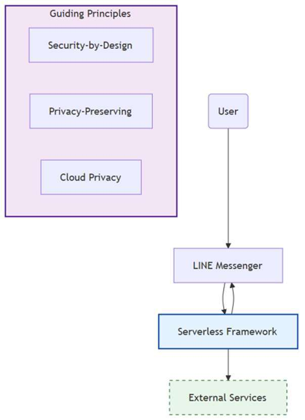
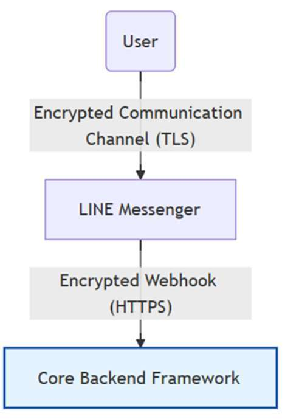
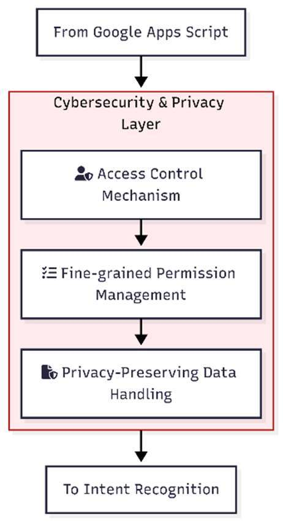
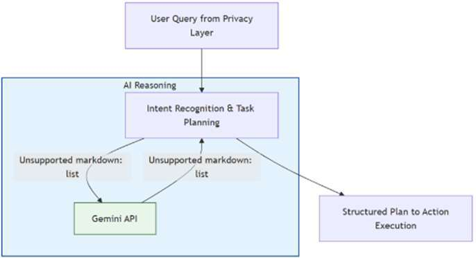
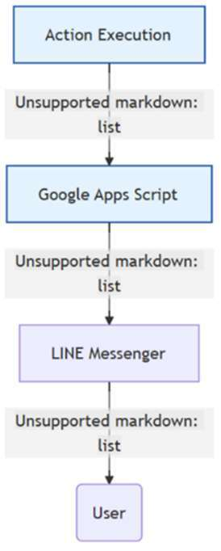
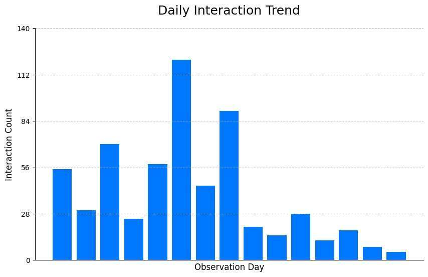
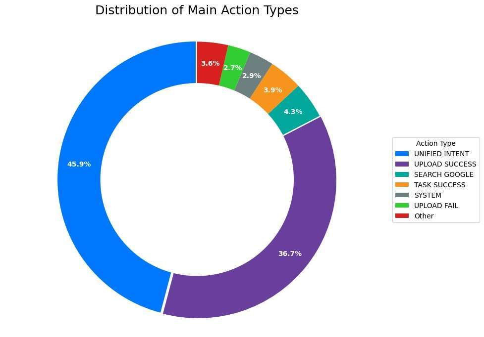
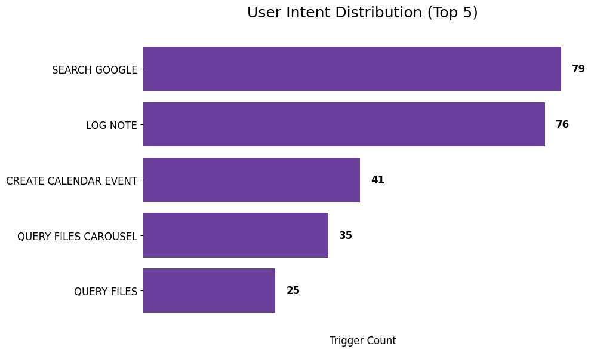
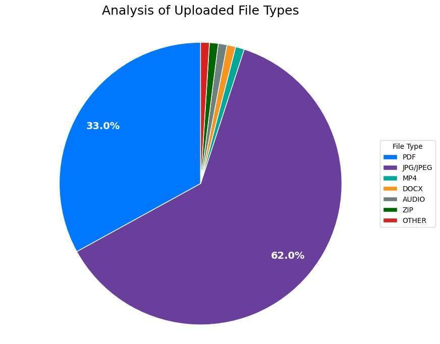

# From Traditional Semantic Analysis to Generative AI: Research on Cybersecurity and Privacy Challenges in Cloud-Based Educational Task Automation

作者：施育廷

## 文章簡述

大語言模型 (LLM) 的快速發展已將對話代理轉變為 自動化複雜資訊任務的強大工具。然而,在教育和行政環 境中部署基於 LLM 的系統往往會受到後端複雜性和高維 護 需 求 的 阻 礙 。

## 研究重點

- 研究背景：大語言模型 (LLM) 的快速發展已將對話代理轉變為 自動化複雜資訊任務的強大工具。然而,在教育和行政環 境中部署基於 LLM 的系統往往會受到後端複雜性和高維 護 需 求 的 阻 礙 。
- 研究方法：大語言模型 (LLM) 的快速發展已將對話代理轉變為 自動化複雜資訊任務的強大工具。然而,在教育和行政環 境中部署基於 LLM 的系統往往會受到後端複雜性和高維 護 需 求 的 阻 礙 。
- 主要發現：在教育環境中的案例實作證明,我們提出架構不僅提 升了任務效率和使用者體驗,還能以低成本和最小的技術 門檻提供安全、隱私保護的自動化功能。研究結果凸顯了 我們所提框架在可擴展教育任務自動化方面的潛力,以及 其對雲端安全、應用服務安全和隱私感知型人工智慧應用 的廣泛影響。
- 延伸意義：可延伸關注的主題包括：Large Language Models (LLMs)、Educational Task。

## 關鍵主題

Large Language Models (LLMs)、Educational Task

## 內容摘述

大語言模型 (LLM) 的快速發展已將對話代理轉變為 自動化複雜資訊任務的強大工具。然而,在教育和行政環 境中部署基於 LLM 的系統往往會受到後端複雜性和高維 護 需 求 的 阻 礙 。 本 研 究 介 紹GenAI Cloud Executive Secretary,這是一個用於教育任務自動化的輕量級、無伺 服器對話框架。該框架基於 Google Apps Script (GAS) 構建, 以 Gemini 2.0 Flash 作為推理核心,並與 LINE Messaging API 集成,提供自然語言互動,並透過意圖識別和結構化 回饋自主協調 Google Workspace 服務(例如Google雲端 硬碟、Google日曆、Gmail等)。 除了上述功能之外,本研究所提出框架更強調雲端安 全和隱私,透過應用安全設計原則來降低未經授權的存取、 資料外洩和對抗性提示等風險。細粒度存取控制、加密通 訊和權限管理等機制確保符合教育資料保護標準。比較分 析凸顯了基於規則的自動化和LLM驅動的方法在面臨錯 誤分類、幻覺和惡意查詢操縱等威脅時的不同復原能力。 在教育環境中的案例實作證明,我們提出架構不僅提 升了任務效率和使用者體驗,還能以低成本和最小的技術 門檻提供安全、隱私保護的自動化功能。研究結果凸顯了 我們所提框架在可擴展教育任務自動化方面的潛力,以及 其對雲端安全、應用服務安全和隱私感知型人工智慧應用 的廣泛影響。 關鍵詞:大語言模型、教育任務自動化、無伺服器對話框 架、雲端安全與隱私、應用服務安全 ABSTRACT The rapid growth of large language models (LLMs) has advanced conversational agents into powerful tools for automating complex information tasks. However, deploying LLM-based systems in educational and administrative contexts i…

## 圖像摘錄

