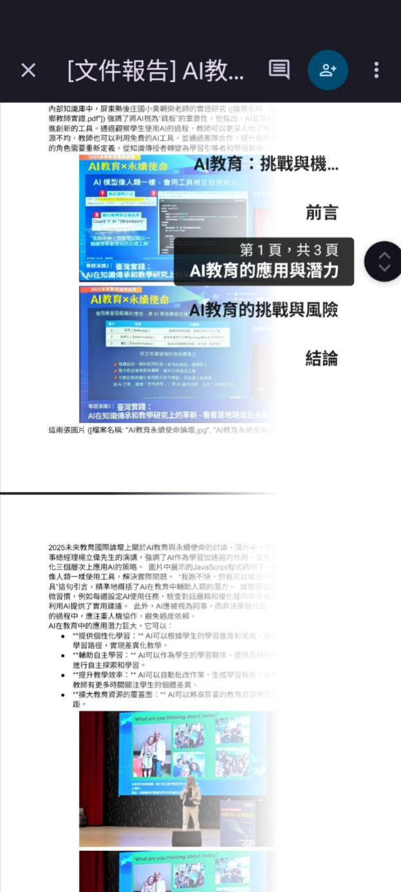

# 優化學習工作流輕量級無伺服器 AI 代理人之開發與成效分析

作者：施育廷

## 文章簡述

本 研 究 提 出 並 實 證 一 款 輕 量 級 無 伺 服 器 人 工 智 慧 ( AI ) 代 理 人 框 架。

## 研究重點

- 研究背景：本 研 究 提 出 並 實 證 一 款 輕 量 級 無 伺 服 器 人 工 智 慧 ( AI ) 代 理 人 框 架。
- 研究方法：本文可見明確的研究設計脈絡，適合作為教育科技與 AI 應用研究之案例參考。
- 主要發現：This study not only confirms the practical potential of lightweight AI agents to optimize educational workflows but also provides actionable guidelines for interface design and pr…
- 延伸意義：可延伸關注的主題包括：Lightweight Architecture、Artificial Intelligence Agent、Technology Acceptance Model。

## 關鍵主題

Lightweight Architecture、Artificial Intelligence Agent、Technology Acceptance Model

## 內容摘述

本 研 究 提 出 並 實 證 一 款 輕 量 級 無 伺 服 器 人 工 智 慧 ( AI ) 代 理 人 框 架。 該 系 統 以 Google Apps Script 作 為 簡 易 執 行 層 , 無 縫 整 合 於 多 數 校 園 既 有 之 Google Workspace 環 境 中 , 並 結 合 雲 端 大 型 語 言 模 型 ( Gemini ) 處 理 自 然 語 言 理 解 與 任 務 規 劃 , 達 成 免 額 外 安 裝 且 低 門 檻 的 AI 協 作 體 驗。 本 研 究 針 對 103 位 實 際 參 與 學 習 活 動 之 使 用 者 進 行 結 構 化 問 卷 調 查 , 結 合 科 技 接 受 模 式 ( Technology Acceptance Model , TAM ) 評 估 其 對 該 系 統 之 認 知 有 用 性、 認 知 易 用 性 與 整 體 滿 意 度。 量 化 分 析 結 果 顯 示 : 第 一 , 輕 量 化 架 構 有 效 降 低 工 具 操 作 門 檻 , 學 習 者 對 系 統 易 用 性 與 整 體 滿 意 度 均 給 予 高 度 正 向 評 價 ; 第 二 , 使 用 者 背 景 具 備 顯 著 的 「 AI 經 驗 落 差」 , 缺 乏 提 示 詞 ( prompt ) 建 構 經 驗 的 新 手 在 各 項 系 統 評 價 上 明 顯 偏 低 , 凸 顯 未 來 系 統 內 建 認 知 鷹 架 之 必 要 性 ; 第 三 , 資 料 隱 私 疑 慮 會 對 系 統 體 驗 產 生 負 面 效 應 , 使 用 者 的 防 備 心 態 連 帶 降 低 了 其 對 工 具 實 用 性 的 客 觀 感 受。 本 研 究 不 僅 證 實 輕 量 級 AI 代 理 人 優 化 教 育 工 作 流 的 實 務 潛 力 , 亦 為 未 來 教 育 科 技 的 介 面 設 計 與 隱 私 透 明 化 機 制 提 供 具 體 的 參 考 指 引。 關 鍵 字 : 輕 量 級 架 構、 人 工 智 慧 代 理 人…

## 圖像摘錄

