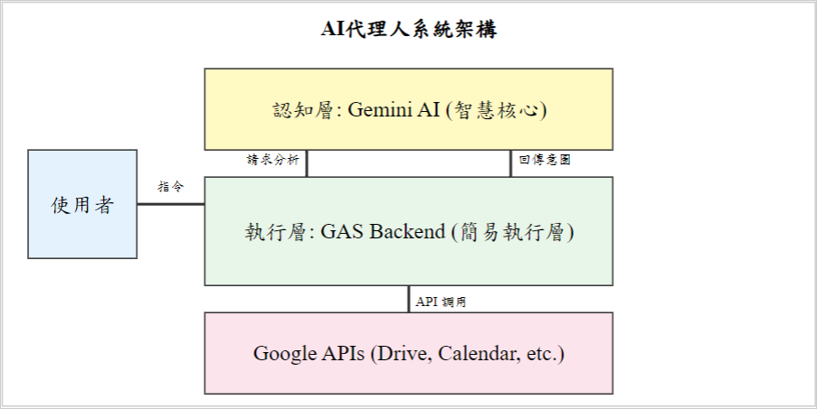
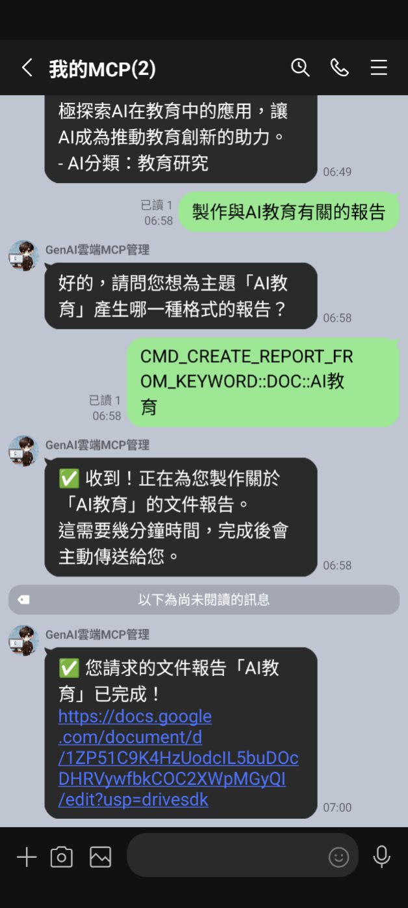

# Development and Effectiveness Analysis of a Lightweight Serverless AI Agent for Optimizing Learning Workflows

Author: Yu-Ting Shih

## Overview

This study proposes and empirically validates a lightweight, serverless Artificial Intelligence (AI) agent framework.

## Key Points

- Background: This study proposes and empirically validates a lightweight, serverless Artificial Intelligence (AI) agent framework.
- Method: The study presents a clear research design that can support further work in educational technology and AI-supported learning.
- Findings: The article highlights the value and applicability of AI-related approaches in educational and learning contexts.
- Significance: Relevant themes for follow-up discussion include: Lightweight Architecture, Artificial Intelligence Agent, Technology Acceptance Model.

## Keywords

Lightweight Architecture, Artificial Intelligence Agent, Technology Acceptance Model

## Summary

This study proposes and empirically validates a lightweight, serverless Artificial Intelligence (AI) agent framework. The system utilizes Google Apps Script as a streamlined execution layer seamlessly integrated into the existing Google Workspace environments of most campuses. By coupling with a cloud-based large language model (Gemini) for natural language understanding and task planning, the framework delivers a low-barrier AI collaboration experience without requiring additional installations. A structured survey was conducted with 103 participants involved in learning activities, evaluating their perceived usefulness, perceived ease of use, and overall system satisfaction based on the Technology Acceptance Model (TAM). Quantitative analysis revealed three main findings. First, the lightweight architecture effectively lowers operational barriers, leading to highly positive evaluations for system ease of use and overall satisfaction. Second, a significant "AI experience gap" exists…

## Extracted Figures

