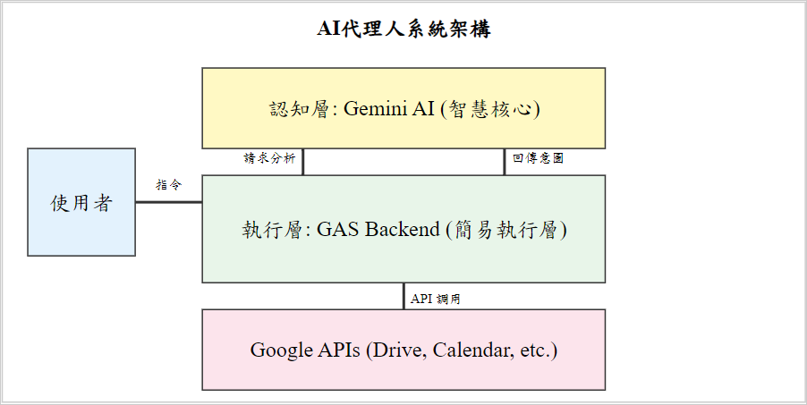
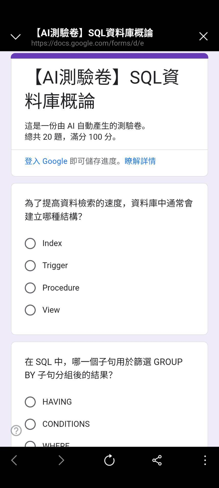
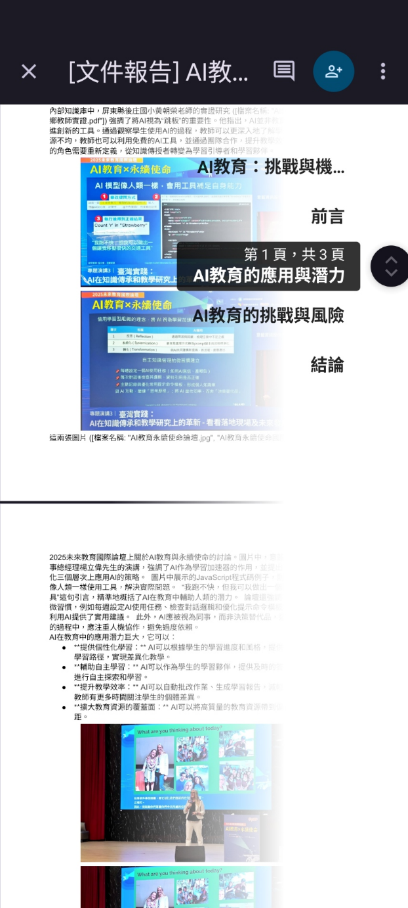
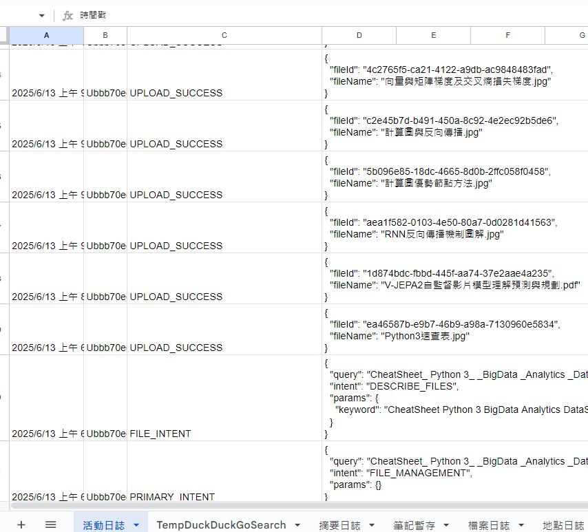
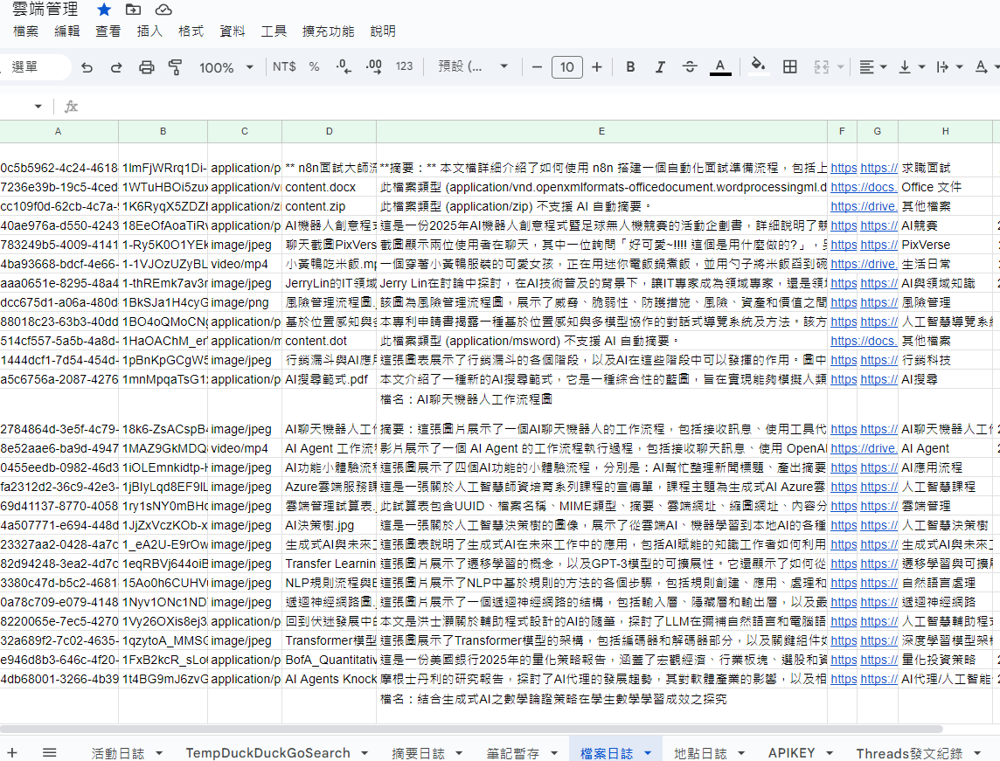

# 優化教學場域與學習效率之輕量級無伺服器AI代理人應用

作者：施育廷

## 文章簡述

彙整 TASK_SUCCESS 41 3.7 複 雜 工 作 流 自 動 化、內 容 合 成 其 他 165 14.7 含 查 詢、 行 事 曆 紀 錄、寄 發 mail 、 失 敗 日 誌 等 4.3 質 性 主 題 分 析 : 教 育 應 用 模 式 4.3.1 統 一 教…

## 研究重點

- 研究背景：彙整 TASK_SUCCESS 41 3.7 複 雜 工 作 流 自 動 化、內 容 合 成 其 他 165 14.7 含 查 詢、 行 事 曆 紀 錄、寄 發 mail 、 失 敗 日 誌 等 4.3 質 性 主 題 分 析 : 教 育 應 用 模 式 4.3.1 統 一 教…
- 研究方法：本文可見明確的研究設計脈絡，適合作為教育科技與 AI 應用研究之案例參考。
- 主要發現：In International Conference on Learning Representations (ICLR) .
- 延伸意義：本文適合作為後續研究設計、課程實作或系統開發的參考起點。

## 內容摘述

彙整 TASK_SUCCESS 41 3.7 複 雜 工 作 流 自 動 化、內 容 合 成 其 他 165 14.7 含 查 詢、 行 事 曆 紀 錄、寄 發 mail 、 失 敗 日 誌 等 4.3 質 性 主 題 分 析 : 教 育 應 用 模 式 4.3.1 統 一 教 學 行 政 工 作 流 日 誌 分 析 顯 示 , 代 理 人 被 頻 繁 用 於 自 動 化 瑣 碎 的 教 學 行 政 任 務。 這 些 功 能 將 教 師 從 繁 瑣 的 平 台 切 換 中 解 放 出 來 , 直 接 降 低 了 其 外 在 認 知 負 荷 , 使 其 能 更 專 注 於 課 程 內 容 的 準 備 與 教 學 活 動 的 設 計。 例 如 可 以 根 據 需 求 產 出 課 程 練 習 測 驗 卷 , 快 速 進 行 學 生 學 前 能 力 或 迅 速 進 行 課 後 練 習。 如 圖 2 所 示。 圖 2. AI 代 理 人 於 LINE 介 面 中 的 互 動 範 例。 使 用 者 輸 入 自 然 語 言 指 令 後 , 代 理 人 回 覆 已 成 功 建 立 測 驗 卷 事 件 , 取 代 了 傳 統 的 多 步 驟 手 動 操 作。 4.3.2 即 時 生 成 個 人 化 學 習 內 容 這 是 本 研 究 最 具 教 育 創 新 性 的 發 現。 使 用 者 不 僅 利 用 代 理 人 執 行 單 一 任 務 , 更 開 始 要 求 其 進 行 「跨 文 件 的 內 容 合 成」。 當 使 用 者 發 出 特 定 指 令 時 , 代 理 人 能 夠 自 主 完 成 複 雜 工 作 流 , 生 成 結 構 化 的 報 告 或 摘 要 (如 圖 3 所 示)。 代 理 人 能 整 合 多 份 來 源 文 件 , 產 出 結 構 化 的 摘 要 內 容 , 作 為 客 製 化 學 習 材 料。 此 功 能 對 教 師 而 言 , 可 快 速 生 成 差 異 化 教 學 材 料 ; 對 學 生 而 言 , 這 是 一 種 強 而 有 力 的 學 習 鷹 架 , 輔…

## 圖像摘錄

