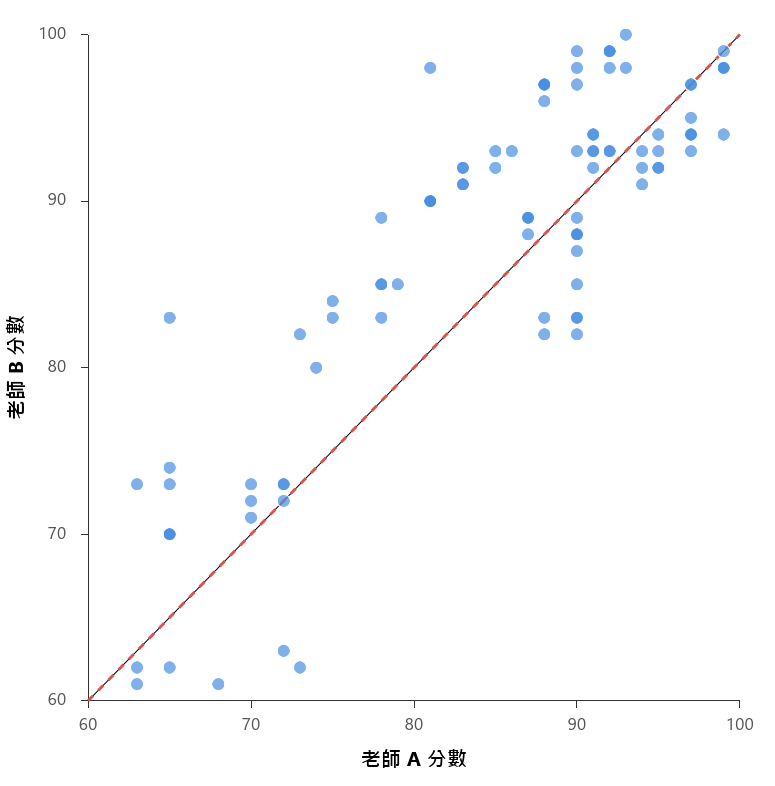
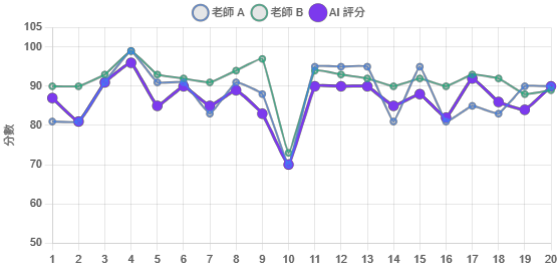

# 探討 GenAI人機協作評量之信度與差異分析

作者：施育廷、張敦程

發表資訊：施育廷、張敦程（2026年6月6日）。探討 GenAI人機協作評量之信度與差異分析【論文發表】。2026年第七屆台灣商業教育與管理研討會，臺南，臺灣。

## 文章簡述

在教育評量領域中,評分的公平性與客觀性至關重要。隨著生成式人工智慧技術成 熟,其在學習評量上的應用潛力備受關注,但其評分標準與人類教師的差異仍需實證 檢驗。本研究以台中市某大學一年級非資訊背景學生為研究對象,探討其於「資料科 學與問題解決」課程中導入 AI 評分回饋系統的成效。…

## 研究重點

- 研究背景：在教育評量領域中,評分的公平性與客觀性至關重要。隨著生成式人工智慧技術成 熟,其在學習評量上的應用潛力備受關注,但其評分標準與人類教師的差異仍需實證 檢驗。本研究以台中市某大學一年級非資訊背景學生為研究對象,探討其於「資料科 學與問題解決」課程中導入 AI 評分回饋系統的成效。…
- 研究方法：在教育評量領域中,評分的公平性與客觀性至關重要。隨著生成式人工智慧技術成 熟,其在學習評量上的應用潛力備受關注,但其評分標準與人類教師的差異仍需實證 檢驗。本研究以台中市某大學一年級非資訊背景學生為研究對象,探討其於「資料科 學與問題解決」課程中導入 AI 評分回饋系統的成效。研究分為兩階段進行:首先,由 兩位具備不…
- 主要發現：針對個人作業的初步分析顯示,兩位不同背景的教師具備極高的評分信度( r=.83, ICC=.82,p<.001),顯示雙方對作業優劣具備高度共識。然而,成對樣本 t 檢定指出 兩者在評分標準上存在顯著差異,t(99)=5.25,p<.001;老師 B 的平均分數(M=87.60, SD=10.66)顯著高於老師 A(M=84.81,SD=10.94),呈現…
- 延伸意義：可延伸關注的主題包括：學習評量、生成式人工智慧、評分者間信度、人機協作、自動化評分。

## 關鍵主題

學習評量、生成式人工智慧、評分者間信度、人機協作、自動化評分

## 內容摘述

在教育評量領域中,評分的公平性與客觀性至關重要。隨著生成式人工智慧技術成 熟,其在學習評量上的應用潛力備受關注,但其評分標準與人類教師的差異仍需實證 檢驗。本研究以台中市某大學一年級非資訊背景學生為研究對象,探討其於「資料科 學與問題解決」課程中導入 AI 評分回饋系統的成效。研究分為兩階段進行:首先,由 兩位具備不同專業背景的人類教師(老師 A 與老師 B)針對 100 份學生個人作業進行獨 立評分,以檢驗並確立人類評分標準的信度;其次,針對學生分組進行的 20 組「議題 分析報告」,導入團隊自主設計的 AI 評分回饋系統,藉此比較兩位教師與 AI 給分的差 異。資料分析採用 SPSS 軟體進行成對樣本 t 檢定、皮爾森積差相關與組內相關係數 (ICC)分析。 針對個人作業的初步分析顯示,兩位不同背景的教師具備極高的評分信度( r=.83, ICC=.82,p<.001),顯示雙方對作業優劣具備高度共識。然而,成對樣本 t 檢定指出 兩者在評分標準上存在顯著差異,t(99)=5.25,p<.001;老師 B 的平均分數(M=87.60, SD=10.66)顯著高於老師 A(M=84.81,SD=10.94),呈現系統性的給分尺度差異。其 評分結果散佈圖如圖 1 所示。 圖 1 老師 A 與老師 B 評分結果散佈圖 2026 年第七屆台灣商業教育與管理研討會 在針對 20 組議題分析報告的人機協作階段(如表 1 所示),AI 評分與兩位人類教師皆 呈現高度正相關(r 分別為.81 與.80),證明 AI 能有效反映各組報告的品質差異。但在 給分寬嚴度上, AI 的給分標準最為嚴格,其平均分數( M=86.70)皆低於同批報告中 的老師 A(M=87.80)與老師 B(M=91.25)。本研究亦將老師 A、老師 B 與 AI 進行評 分視覺化,呈現每一組學生在三種評分下的得分情形。 表 1 人機協作評分之描述性統計與相關分析 (N = 20) 老師 M SD 最小值 最大值 與老師 A 相關 (r) 與老師 B 相關 (r) 老師 A 87.80 6.85 70 99…

## 圖像摘錄

