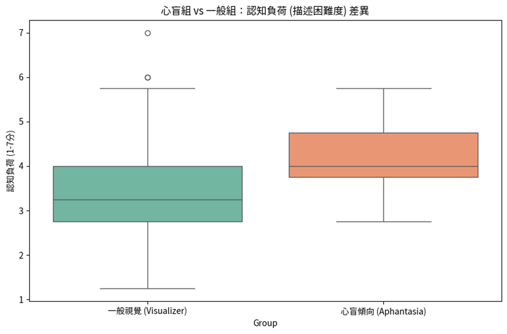
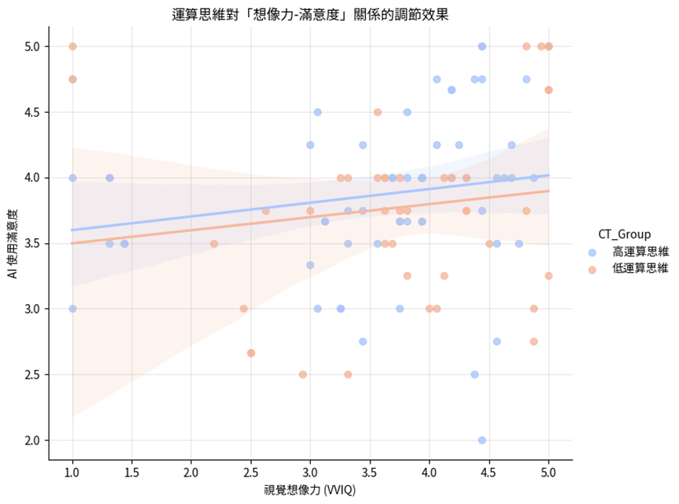

# 施育廷 TWELF2026 (2)

作者：施育廷

## 文章簡述

】 生成式 AI 與「氛圍編碼」 (Vibe Coding )的興起,使提示工程成為核心素 養。然而缺乏內在心像的「心盲症」 (Aphantasia)使用者構成了隱性門檻。

## 研究重點

- 研究背景：】 生成式 AI 與「氛圍編碼」 (Vibe Coding )的興起,使提示工程成為核心素 養。然而缺乏內在心像的「心盲症」 (Aphantasia)使用者構成了隱性門檻。
- 研究方法：本研究對 象為大學一年級學生 (N=103 ),整合 VVIQ、運算思維與科技接受度模型進行量化分 析。結果顯示: (1) 心盲傾向者將抽象概念轉譯為提示詞時 有顯著較高的認知負荷 (t=2.38,p<.05 );(2) 運算思維對 AI 使用滿意度具有顯著的正向影響 (β=0.20,p<.01 )。研 究顯示高運算…
- 主要發現：本研究對 象為大學一年級學生 (N=103 ),整合 VVIQ、運算思維與科技接受度模型進行量化分 析。結果顯示: (1) 心盲傾向者將抽象概念轉譯為提示詞時 有顯著較高的認知負荷 (t=2.38,p<.05 );(2) 運算思維對 AI 使用滿意度具有顯著的正向影響 (β=0.20,p<.01 )。研 究顯示高運算思維能有效抵銷視覺想像不足的劣勢,提升互…
- 延伸意義：可延伸關注的主題包括：Aphantasia、Generative AI、Computational Thinking、Cognitive Load、Vibe。

## 關鍵主題

Aphantasia、Generative AI、Computational Thinking、Cognitive Load、Vibe

## 內容摘述

】 生成式 AI 與「氛圍編碼」 (Vibe Coding )的興起,使提示工程成為核心素 養。然而缺乏內在心像的「心盲症」 (Aphantasia)使用者構成了隱性門檻。 本研究對 象為大學一年級學生 (N=103 ),整合 VVIQ、運算思維與科技接受度模型進行量化分 析。結果顯示: (1) 心盲傾向者將抽象概念轉譯為提示詞時 有顯著較高的認知負荷 (t=2.38,p<.05 );(2) 運算思維對 AI 使用滿意度具有顯著的正向影響 (β=0.20,p<.01 )。研 究顯示高運算思維能有效抵銷視覺想像不足的劣勢,提升互動滿意度。結論指出運算 思維是與 AI 互動過程中能 跨越感官限制,建議未來 AI 教育應從「感官描述」 結合 「邏輯結構」訓練,以落實 AI 應用教育。 【關鍵詞】心盲、生成式 AI、運算思維、認知負荷、Vibe Coding Abstract: The emergence of Generative AI and "Vibe Coding" has established prompt engineering as a core competency. However, this poses a latent barrier for users with aphantasia, who lack voluntary mental imagery. This study conducted a quantitative analysis on 103 first -year university students by integrating the Vividness of Visual Imagery Questionnaire (VVIQ), Computational Thinking (CT), and the Technology Acceptance Model (TAM). The results indicate that: (1) individuals with aphantasic tendencies experien…

## 圖像摘錄

