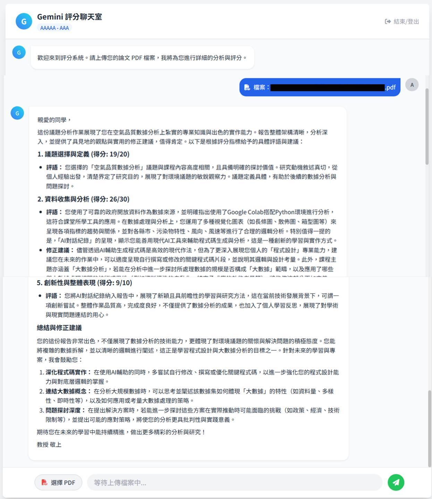
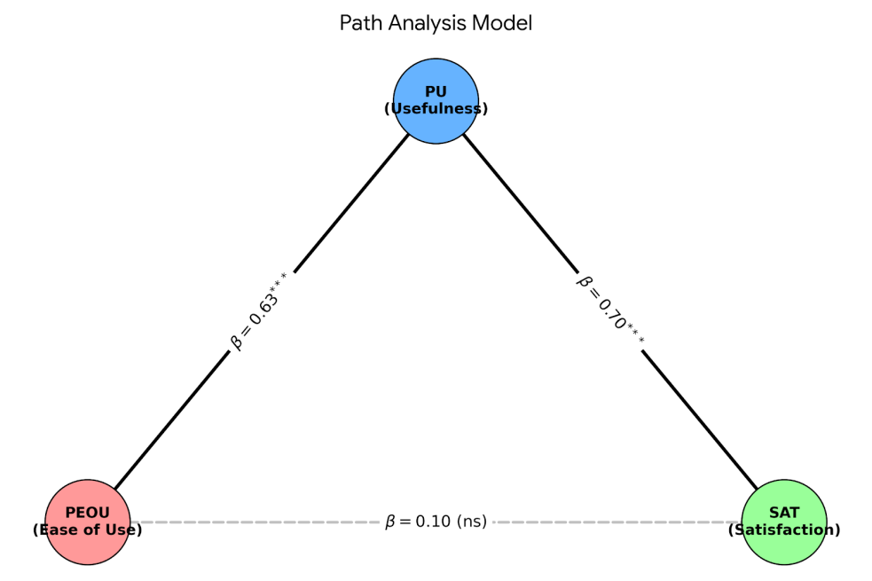
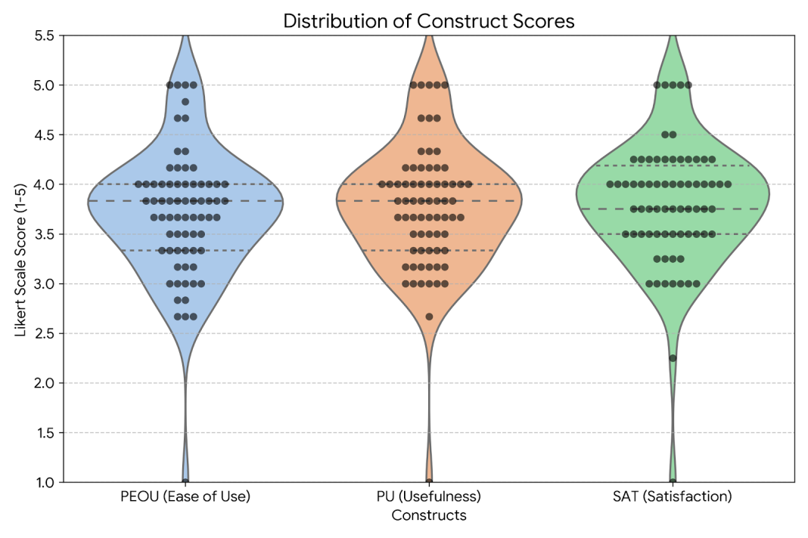

# 生成式 AI 自動評分與回饋系統之滿意度與需求分析

作者：施育廷

## 文章簡述

隨著生成式人工智慧(GenerativeAI)技術日益成熟,自動化評分與回饋系統成 為減輕教師負擔並提供學生個人化學習指引的重要輔助工具 。本研究針對某大學「資 料科學與問題解決」課程之大一學生,探討導入自行設計之「生成式 AI自動化評分與 回饋系統」的實施成效。基於科技接受模…

## 研究重點

- 研究背景：隨著生成式人工智慧(GenerativeAI)技術日益成熟,自動化評分與回饋系統成 為減輕教師負擔並提供學生個人化學習指引的重要輔助工具 。本研究針對某大學「資 料科學與問題解決」課程之大一學生,探討導入自行設計之「生成式 AI自動化評分與 回饋系統」的實施成效。基於科技接受模…
- 研究方法：隨著生成式人工智慧(GenerativeAI)技術日益成熟,自動化評分與回饋系統成 為減輕教師負擔並提供學生個人化學習指引的重要輔助工具 。本研究針對某大學「資 料科學與問題解決」課程之大一學生,探討導入自行設計之「生成式 AI自動化評分與 回饋系統」的實施成效。基於科技接受模式(TAM),本研究透過線上問卷回收70…
- 主要發現：隨著生成式人工智慧(GenerativeAI)技術日益成熟,自動化評分與回饋系統成 為減輕教師負擔並提供學生個人化學習指引的重要輔助工具 。本研究針對某大學「資 料科學與問題解決」課程之大一學生,探討導入自行設計之「生成式 AI自動化評分與 回饋系統」的實施成效。基於科技接受模式(TAM),本研究透過線上問卷回收70份有 效樣本,採混合研究取向分析學生之認…
- 延伸意義：可延伸關注的主題包括：生成式人工智慧、自動化評分系統、虛擬人設。

## 關鍵主題

生成式人工智慧、自動化評分系統、虛擬人設

## 內容摘述

隨著生成式人工智慧(GenerativeAI)技術日益成熟,自動化評分與回饋系統成 為減輕教師負擔並提供學生個人化學習指引的重要輔助工具 。本研究針對某大學「資 料科學與問題解決」課程之大一學生,探討導入自行設計之「生成式 AI自動化評分與 回饋系統」的實施成效。基於科技接受模式(TAM),本研究透過線上問卷回收70份有 效樣本,採混合研究取向分析學生之認知易用性( PEOU)、認知有用性(PU)與整體 使用滿意度(SAT)間的關聯及具體學習痛點。路徑分析結果顯示,認知有用性完全中 介了認知易用性與滿意度之間的關係( β=.70,p<.001),證實系統介面的直觀性並非 決定滿意度的唯一因素,實質改善報告品質的能力才是核心 。此外,質性主題分析進 一步指出,學生強烈需要AI系統提供具體指引、統整知識架構並搭建學習鷹架 。本研 究建議,未來的教育AI系統優化應著重於底層提示詞(Prompts)的深度精煉,並賦予 AI專業的虛擬人設(VirtualPersona),藉此強制產出具邏輯層次的結構化建議,以 最大化生成式AI在高等教育中的輔助價值。

## 圖像摘錄

