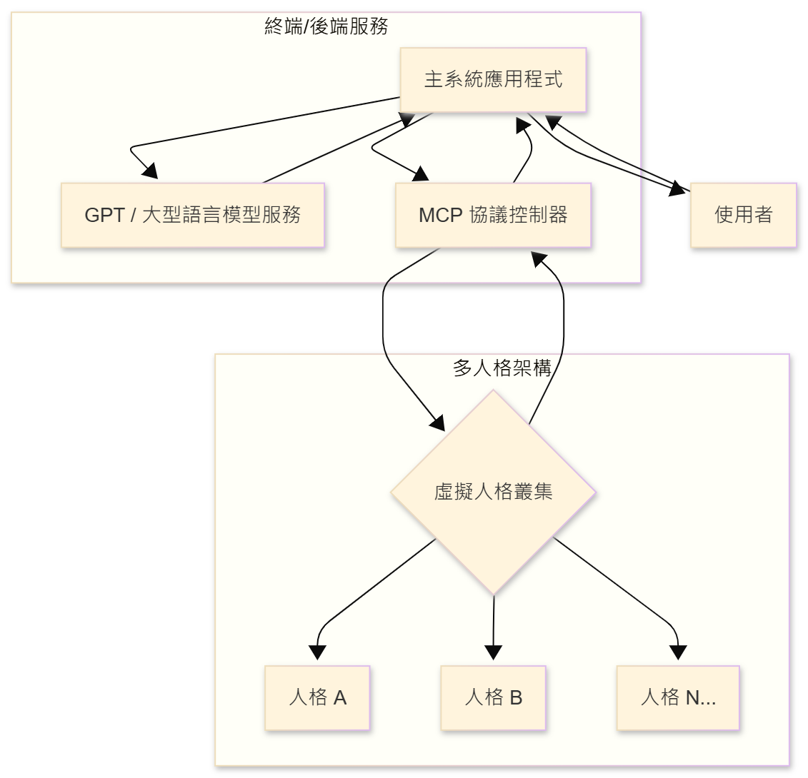
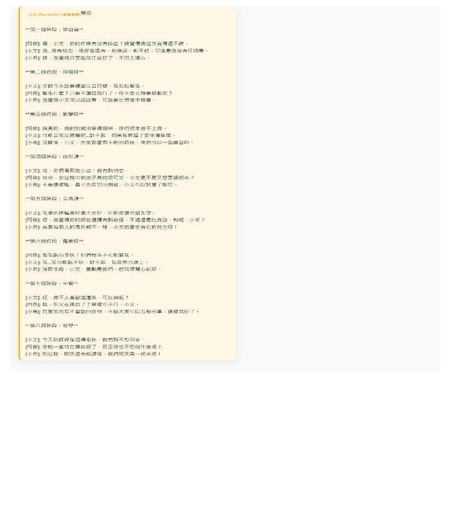

# Positive Reflective Activities Through Multiple Virtual Students in Generative AI-Based Bullying Scenario Simulations

Author: Yu-Ting Shih

## Overview

This article centers on Positive Reflective Activities Through Multiple Virtual Students in Generative AI-Based Bullying Scenario Simulations and highlights the study background, method, findings, and practical implications.

## Key Points

- Background: This article centers on Positive Reflective Activities Through Multiple Virtual Students in Generative AI-Based Bullying Scenario Simulations and highlights the study background, method, findings, and practical implications.
- Method: The study presents a clear research design that can support further work in educational technology and AI-supported learning.
- Findings: The article highlights the value and applicability of AI-related approaches in educational and learning contexts.
- Significance: This article can serve as a reference point for future research design, instructional practice, or system development.

## Summary

This article centers on Positive Reflective Activities Through Multiple Virtual Students in Generative AI-Based Bullying Scenario Simulations and highlights the study background, method, findings, and practical implications.

## Extracted Figures

